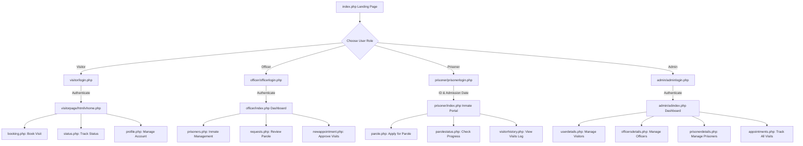

# JailMeet - Prison Visitation & Parole Management System

JailMeet is an online platform designed to bridge the gap between incarcerated individuals and their families. It provides a seamless, secure, and user-friendly system for scheduling prison visits, tracking appointment statuses, logging inmate information (such as FIR records and health logs), and submitting/reviewing parole applications.

---

## Tech Stack
*   **Backend Language:** PHP (mix of procedural and Object-Oriented styles, using `mysqli` extension)
*   **Database:** MySQL (relational database storage)
*   **Frontend Technologies:** HTML5, CSS3, JavaScript, SCSS
*   **Styling & Frameworks:** Bootstrap v5
    *   *Landing/Guest Pages:* [Dewi Theme](https://bootstrapmade.com/dewi-free-multi-purpose-html-template/)
    *   *Visitor Dashboard:* [Sneat Admin Template](https://themeselection.com/products/category/bootstrap-admin-templates/)
    *   *Admin/Officer/Prisoner Dashboards:* Custom Bootstrap integrations
*   **Local Server Environment:** Compatible with XAMPP, WAMP, or Laragon

---

## Folder Structure Explanation

The project is structured into four main functional user modules, alongside shared layouts and media assets:

```text
JailMeet/
├── admin/               # Admin Module: Dashboard, user control, and overall system management
│   ├── assets/          # CSS, JS, and vendor files for the Admin dashboard
│   ├── assets1/         # Secondary assets for Admin layout
│   ├── components/      # Reusable HTML layout elements (notifications, panels, etc.)
│   ├── includes/        # Shared Admin layouts: header, navbar, sidebar
│   ├── tables/          # HTML tables templates
│   ├── db.php           # Admin module database configuration
│   └── adindex.php      # Main Admin dashboard entry point
├── assets/              # Global asset files (CSS, JS, images, vendors) for the landing pages
├── forms/               # Landing page PHP contact and newsletter submission handlers
├── includes/            # Landing page header and footer templates
├── officer/             # Officer Module: Dashboard, inmate management, and appointment approvals
│   ├── assets/          # CSS, JS, and vendor files for the Officer panel
│   ├── includes/        # Shared layouts for Officer dashboard
│   ├── uploads/         # Upload directory for prisoner profile pictures
│   ├── db.php           # Officer module database configuration
│   └── index.php        # Main Officer dashboard entry point
├── prisoner/            # Prisoner Module: Sentence lookup, health details, and parole submissions
│   ├── assets/          # CSS, JS, and vendor files for the Prisoner dashboard
│   ├── includes/        # Shared layouts for Prisoner panel
│   ├── db.php           # Prisoner module database configuration
│   └── index.php        # Main Prisoner dashboard entry point
├── uploads/             # Global upload directory
├── visitor/             # Visitor Module: Account registration, logins, and bookings
│   ├── assets/          # CSS and vendor libraries for visitor signup and login page
│   ├── includes/        # Header and footer templates for visitor signup and login page
│   ├── profilepics/     # Uploaded visitor profile pictures
│   ├── db.php           # Database configuration for visitor login/register pages
│   └── visitorpage/     # Sneat Admin template workspace for Visitor Dashboard
│       ├── assets/      # JS, CSS, and vendor assets for the dashboard
│       └── html/        # Visitor pages: booking, status, profile, vhome
├── index.php            # Root Entry Point: Public guest landing page
├── jailmeet.sql         # Database schema import script (created during analysis)
└── Readme.txt           # Template metadata details
```

---

## Important Files

### 1. Entry Points
*   **Public Guest Landing Page:** `index.php` (Root)
*   **Visitor Entry:** `visitor/login.php` & `visitor/register.php`
*   **Officer Entry:** `officer/officerlogin.php`
*   **Prisoner Entry:** `prisoner/prisonerlogin.php`
*   **Admin Entry:** `admin/adminlogin.php`

### 2. Database Connection Files
The application uses separate database connection files for each module:
1.  `visitor/db.php` — Used by visitor registration/login.
2.  `visitor/visitorpage/html/db.php` — Used by visitor dashboard pages.
3.  `admin/db.php` — Used by some admin pages.
4.  `officer/db.php` — Used by officer dashboards.
5.  `prisoner/db.php` — Used by prisoner portals.

### 3. Duplicate Hardcoded Connection Blocks
The following files **do not** include `db.php` and instead hardcode the database connection string directly:
*   `admin/admindetails.php`
*   `admin/adminprofile.php`
*   `admin/officersdetails.php`
*   `admin/profileedit.php`
*   `admin/userdetails.php`
*   `admin/update_admin.php`
*   `admin/delete_admin.php`
*   `admin/appointments.php`
*   `admin/appointmentdetails.php`

---

## Database Setup

Since no SQL schema was initially packaged with the code, the database schema has been reconstructed by analyzing the query structure of the PHP files. A file named `jailmeet.sql` has been created in the project root to automate this setup.

### Required Tables and Schema

#### 1. `admin`
Stores administrative accounts.
*   `ad_id` (INT, Primary Key, Auto Increment)
*   `ad_name` (VARCHAR)
*   `ad_email` (VARCHAR, Unique)
*   `ad_password` (VARCHAR) — *Stores BCrypt hashes and fallback plain-text passwords.*

#### 2. `officer`
Stores prison officers who manage inmates and visitation appointments.
*   `id` (INT, Primary Key, Auto Increment)
*   `ofname` (VARCHAR)
*   `ofemail` (VARCHAR, Unique)
*   `ofpass` (VARCHAR) — *Plain-text comparison is used for verification.*
*   `ofphno` (VARCHAR)

#### 3. `visitors`
Stores visitor accounts.
*   `vid` (INT, Primary Key, Auto Increment)
*   `vname` (VARCHAR)
*   `vemail` (VARCHAR, Unique)
*   `vpass` (VARCHAR) — *Plain-text comparison is used.*
*   `vphno` (VARCHAR)
*   `vstate` (VARCHAR)
*   `vadd` (VARCHAR)
*   `vzip` (VARCHAR)
*   `profile_pic` (VARCHAR)

#### 4. `prisoner`
Stores prisoner data, medical checkups, FIR logs, and parole requests.
*   `pris_id` (INT, Primary Key, Auto Increment)
*   `pris_name` (VARCHAR)
*   `pris_age` (INT)
*   `pris_gender` (VARCHAR)
*   `pris_case` (TEXT) — *Crime description.*
*   `pris_adm` (DATE) — *Admission date (Incarceration Date).*
*   `pris_period` (VARCHAR) — *Sentence period.*
*   `jailtype` (VARCHAR)
*   `jailname` (VARCHAR)
*   `pris_cell` (VARCHAR)
*   `checkup` (VARCHAR) — *Latest medical examination notes.*
*   `blood` (VARCHAR)
*   `allergies` (VARCHAR)
*   `dp` (VARCHAR) — *Filename of profile image.*
*   `par_status` (VARCHAR) — *Parole status: Empty, `Pending`, `Accepted`, `Rejected`.*
*   `fir_number` (VARCHAR) — *Auto-generated FIR number.*
*   `fir` (TEXT) — *Details of the logged FIR.*
*   `fir_date` (DATE)
*   `par_name` (VARCHAR) — *Parole guarantor name.*
*   `par_rel` (VARCHAR) — *Guarantor's relationship.*
*   `par_purp` (VARCHAR) — *Parole purpose description.*
*   `par_msg` (TEXT) — *Inmate's parole statement.*
*   `parole_from` (DATE) — *Parole start date.*
*   `parole_to` (DATE) — *Parole end date.*
*   `parole_msg` (TEXT) — *Officer's notes on parole.*
*   `reject_msg` (TEXT) — *Reason for parole rejection.*

#### 5. `appointments`
Tracks scheduled prison visits.
*   `id` (INT, Primary Key, Auto Increment)
*   `name` (VARCHAR) — *Visitor name on form.*
*   `prisid` (INT) — *Target Prisoner ID.*
*   `email` (VARCHAR) — *Visitor contact email.*
*   `phno` (VARCHAR) — *Visitor contact phone.*
*   `message` (TEXT) — *Visitor's notes.*
*   `relation` (VARCHAR) — *Relation to prisoner.*
*   `jtype` (VARCHAR) — *Jail type.*
*   `jname` (VARCHAR) — *Jail name.*
*   `date` (DATE) — *Requested visitation date.*
*   `visitor_id` (INT) — *Visitor ID (Foreign Key).*
*   `accept` (VARCHAR) — *Appointment status: `Pending`, `Accepted`, `Rejected`.*
*   `reply` (VARCHAR) — *Officer feedback message.*
*   `visit_status` (VARCHAR) — *Visit outcome: `Pending`, `Visited`, `Not Visited`.*

---

## How to Run Locally

### 1. Place the Project Folder
1.  Copy the `JailMeet` folder.
2.  Paste it in the root web folder of your local server:
    *   **XAMPP:** `C:\xampp\htdocs\Project\JailMeet\` (Make sure to retain the folder hierarchy `Project/JailMeet` because paths are hardcoded in the codebase, see Common Errors).
    *   **WAMP:** `C:\wamp64\www\Project\JailMeet\`
    *   **Laragon:** `C:\laragon\www\Project\JailMeet\`

### 2. Import the Database in phpMyAdmin
1.  Open your browser and navigate to `http://localhost/phpmyadmin/`.
2.  Click **New** on the left panel to create a new database.
3.  Set the database name to **`jailmeet`** and select collation `utf8mb4_general_ci`, then click **Create**.
4.  Select the newly created `jailmeet` database.
5.  Click the **Import** tab on the top menu bar.
6.  Click **Choose File** and select `jailmeet.sql` located at the root of the `JailMeet` project directory.
7.  Click **Import** (or **Go**) at the bottom.

### 3. Start Server & Open Application
1.  Open the XAMPP Control Panel and start both **Apache** and **MySQL**.
2.  Open your browser and navigate to `http://localhost/Project/JailMeet/index.php`.

---

## Application Flow



### Flow Walkthrough

1.  **Guest Visitor:** Arrives at `index.php`. Reads information on prison visitation policies and clicks **Get Started** to access `visitor/login.php`.
2.  **Visitor Sub-flow:**
    *   Creates an account at `register.php`, selecting their name, email, phone, and district.
    *   Logs in at `login.php` and enters the `visitorpage/html/vhome.php` dashboard.
    *   Views details on inmates under `prisoners.php` or books a visit in `booking.php`.
    *   Reviews whether the officer approved or rejected their appointment inside `status.php`.
3.  **Officer Sub-flow:**
    *   Logs in using credentials (`officer@jailmeet.com` / `officer123`) at `officer/officerlogin.php`.
    *   Redirected to dashboard `index.php` showing visit statistics.
    *   Enters `prisoners.php` to add new prisoner files (assigning cell blocks, recording blood types, uploading inmate profile photos).
    *   Clicks `fir.php` to log legal offenses against an inmate.
    *   Enters `newappointment.php` to approve/reject visiting requests, typing message replies and marking visit outcomes (Visited/Not Visited).
    *   Enters `pendingparole.php` to accept/reject parole applications.
4.  **Prisoner Sub-flow:**
    *   Authenticates on `prisoner/prisonerlogin.php` using their **Prisoner ID** (e.g. `1`) and **Date of Incarceration** (e.g. `2026-07-07`). No traditional password is required.
    *   Enters dashboard `index.php` displaying their personal file, medical info, cell block, and upcoming approved visit schedule.
    *   Navigates to `parole.php` to request a parole release, specifying a guarantor and a reason.
    *   Monitors approvals and officer messages under `parolestatus.php`.
5.  **Admin Sub-flow:**
    *   Logs in at `admin/adminlogin.php` (default: `admin@jailmeet.com` / `admin123`).
    *   Enters `adindex.php` control center.
    *   Manages visitor logs (`userdetails.php`), officer credentials (`officersdetails.php`), prisoner profiles (`prisonerdetails.php`), and system administrators (`admindetails.php`).
    *   Monitors all booked appointments in the system inside `appointments.php`.

---

## Main Features
*   **Multi-role Authentication:** Separate, secure login flows tailored for Administrators, Officers, Visitors, and Inmates.
*   **Visitation Booking System:** Easy appointment scheduling with conflict checking (min date is set to today) and prisoner lookup.
*   **Parole Management:** Inmates request release from their panel; officers verify parole eligibility and input dates of release and restrictions.
*   **Inmate Information Logging (FIR & Medical):** Prison officers record and track medical details (blood types, allergies, checkups) and legal FIR entries.
*   **Real-time Visit Tracking:** Officers mark visits as "Visited" or "Not Visited" and write feedback messages visible on visitor dashboards.
*   **Responsive Control Panels:** Sleek templates utilizing charts and icons for managing system details.

---

## Admin/User Login Details

The database import script initializes the system with these fallback developer credentials:

*   **Administrator Account:**
    *   *Email:* `admin@jailmeet.com`
    *   *Password:* `admin123`
*   **Officer Account:**
    *   *Email:* `officer@jailmeet.com`
    *   *Password:* `officer123`
*   **Prisoner Login (Simulated):**
    *   *ID:* `1` (Once a prisoner is inserted via the dashboard)
    *   *Password:* The date input matching the prisoner's Admission Date (`pris_adm` column).

---

## Common Errors and Fixes

During developer analysis, several logical discrepancies, hardcoded paths, and potential bugs were identified:

### 1. Hardcoded Base Paths (`/Project/JailMeet/`)
**Error:** Redirections and references to local URLs throughout the app contain the directory path `/Project/JailMeet/`. For example, visitor login redirects to `/Project/JailMeet/visitor/visitorpage/html/vhome.php`. If your directory is simply named `jailmeet` in `htdocs`, these redirects will trigger **404 Not Found** errors.
*   **Fix:** Ensure your project folder on your local server is nested inside a folder named `Project` (so the path looks like `htdocs/Project/JailMeet`), OR edit the redirect headers (e.g., in `visitor/login.php`, `visitor/visitorpage/html/booking.php`) to use relative paths (e.g., `header("Location: ../visitorpage/html/vhome.php")`).

### 2. macOS-Specific Absolute File Path in Visitor Dashboard
**Error:** In `visitor/visitorpage/html/prisoners.php` (line 71), the absolute image directory points to a macOS local path:
`$uploads_dir = '/Applications/XAMPP/xamppfiles/htdocs/Project/JailMeet/officer/uploads/';`
This will crash image retrieval/operations on a Windows system.
*   **Fix:** Change this line to use the dynamic `$_SERVER['DOCUMENT_ROOT']` variable:
    ```php
    $uploads_dir = $_SERVER['DOCUMENT_ROOT'] . '/Project/JailMeet/officer/uploads/';
    ```

### 3. Password Hashing Discrepancy (BCrypt vs Plain Text)
**Error:**
*   In `admin/officersdetails.php`, new officers are inserted with their passwords stored in **plain text**:
    `VALUES ('$ofname', '$ofemail', '$ofpass', '$ofphno')`
*   In `officer/officerlogin.php`, passwords are verified using a basic string comparison:
    `if ($password === $db_password) { ... }`
*   However, in `admin/add_officer.php` (an unused or developer setup file), passwords are saved using **BCrypt Hashing**:
    `password_hash($ofpass, PASSWORD_BCRYPT);`
If an officer is added via `add_officer.php`, their password will be saved as a hash, but the login page will check it as plain text, locking the officer out of the account.
*   **Fix:** Ensure a unified approach is chosen. It is highly recommended to secure all modules (visitor, admin, officer) with `password_hash()` and check with `password_verify()`.

### 4. Admin Dashboard Access Control Vulnerability
**Error:** Admin panel dashboard files (e.g. `admin/adindex.php`, `admin/officersdetails.php`) do **not** check if the user is authenticated. They read the session name, but if it is empty, they do not redirect to `adminlogin.php`. Anyone can access these files by entering the direct URL in a browser.
*   **Fix:** Add session validation headers to the top of all dashboard files (or centrally in `admin/includes/navbar.php`):
    ```php
    if (!isset($_SESSION['ad_id'])) {
        header("Location: adminlogin.php");
        exit();
    }
    ```

### 5. Officer & Prisoner Module Access Control Vulnerabilities
**Error:** Similar to the admin dashboard, files inside the `officer` folder (except `index.php` and `profile_edit.php`) and files inside the `prisoner` folder do not check if a session exists. They will load the template layouts with empty database values if accessed directly.
*   **Fix:** Apply session verification checks at the top of these templates:
    ```php
    // In officer files
    if (!isset($_SESSION['id'])) {
        header("Location: officerlogin.php");
        exit();
    }
    
    // In prisoner files
    if (!isset($_SESSION['pris_id'])) {
        header("Location: prisonerlogin.php");
        exit();
    }
    ```

### 6. Duplicate `session_start()` Calls
**Error:** Files like `admin/adindex.php` start the session multiple times (on line 2 and line 7), and then include layouts that also attempt to call `session_start()`. This can trigger PHP notices: `Notice: A session had already been started - ignoring`.
*   **Fix:** Keep a single, centralized call to `session_start()` at the absolute top of the index files, and remove duplicate calls in sub-includes.

---

## Developer Notes

*   **Code Style Consistency:** The project features a hybrid of procedural MySQL commands (`mysqli_connect()`, `mysqli_query()`) and Object-Oriented statements (`new mysqli()`, `$conn->prepare()`). Standardizing the database queries onto prepared statements using Object-Oriented mysqli or PDO is recommended to avoid SQL injection risks.
*   **Database Credentials Configuration:** If you move the project to a production server, remember that database credentials must be changed individually in the database configuration files:
    *   `admin/db.php`
    *   `officer/db.php`
    *   `prisoner/db.php`
    *   `visitor/db.php`
    *   And also inside the 9 admin details files that hardcode the connection parameters.
